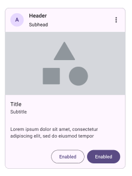
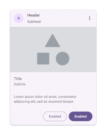
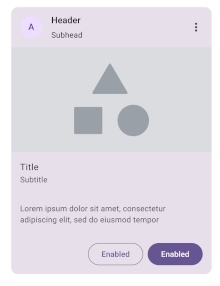
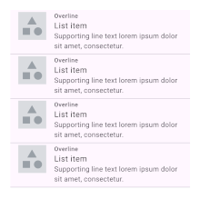
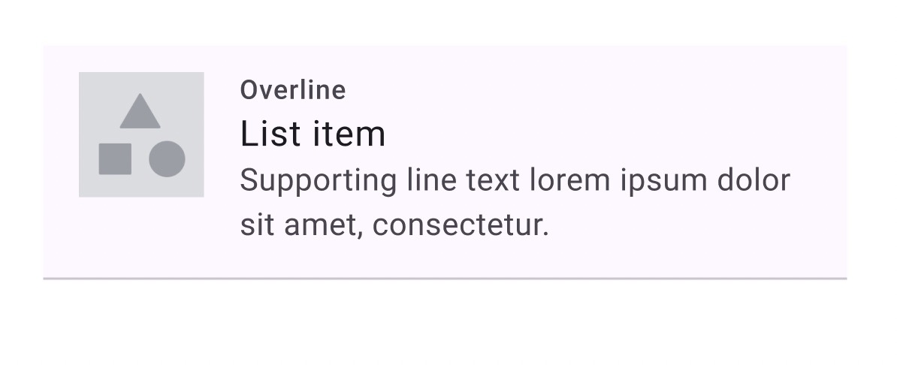

## Guías de Estilos para Android con Material Design 3

Para los proyectos Android se deben seguir las siguientes guías de estilos.

Nota: Para diferenciar los estilos propios del proyecto con otros estilos que incorporan otras librerías
se usa el prefijo "App" en todos los estilos.

Los recursos para usar en las **Apps y Material Design 3** son:
- Fichero [styles.xml](styles/style.xml)
- Fichero [dimens.xml](dimens/dimens.xml)

### CardViews

Componente a usar en la vista: **MaterialCardView**.

#### StackedCard

Existen tres tipos de StackedCard (CardView) según los estilos:

- **Outlined**: estilo AppOutlinedStackedCard
- **Elevated**: estilo AppElevatedStackedCard
- **Filled**: estilo AppFilledStackedCard

**AppOutlinedStackedCard**  
  
**AppElevatedStackedCard**   
  
**AppFilledStackedCard**  

Los estilos definidos para este componente son:

- **Header**: estilo AppHeaderTextStackedCard
- **Subhead**: estilo AppSubheadTextStackedCard
- **Icono con la A**: estilo AppAvatarStackedCard
- **Imagen central**: estilo AppMediaStackedCard
- **Title**: estilo AppTitleHeadlineStackedCard
- **Subtitle**: estilo AppSubheadHeadlineStackedCard
- **'Loren ipsum dolor sit...'**: estilo AppSupportingTextStackedCard

### ListItems

Este elemento se muestra en listados más sencillos.

Un elemento de este listado sería:

Los estilos definidos para este componente son:

- **Overline**: estilo AppOverlineListItem
- **List Item**: estilo AppHeadlineListItem
- **'Supporting line text...'**: estilo AppSupportingTextListItem
- **Imagen**: estilo AppImageListItem